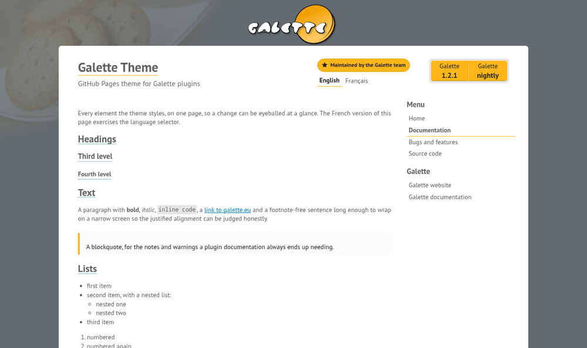

# The Galette theme

[](https://github.com/galette/theme-ghpages/actions/workflows/ci.yml)
[](https://github.com/galette/theme-ghpages/blob/main/LICENSE)

*The GitHub Pages theme for [Galette](https://galette.eu) plugin websites. You can
[preview the theme to see what it looks like](https://galette.github.io/theme-ghpages/),
or [use it today](#usage).*



It carries the same identity as galette.eu — PT Sans, the orange `#ffb619`, the
blue `#007baa`, the grey band behind the logo, the sidebar menu and the orange
download cartouche — and it states on every page whether the plugin is
maintained by the Galette team or by a community member, with a pill whose icon
and outline carry the distinction.

## Usage

On your plugin's `gh-pages` branch, in `_config.yml`:

```yaml
remote_theme: galette/theme-ghpages
title: Galette Fullcard
description: Full member card as PDF
maintainer: core            # core | community
plugin:
  archive: galette-plugin-fullcard
  version: "2.2.1"
  min_galette: "1.3.0"
defaults:
  - scope: {path: ""}
    values: {layout: default}
```

Then set GitHub Pages to build from the `gh-pages` branch, root directory.
Nothing else is needed — no workflow, and no `_layouts` of your own (a local
`_layouts/default.html` would shadow the theme's).

The theme repository **must stay public**: `jekyll-remote-theme` only accepts
"a public GitHub-hosted Jekyll theme", and every consuming site's build would
break the moment it went private.

### Configuration variables

| Key | Required | What it does |
| --- | --- | --- |
| `title` | yes | Plugin name, shown as the page heading |
| `description` | yes | Tagline under the heading, and the meta description. A page may override it with its own `description` front matter — that is how a translated page gets a translated tagline. |
| `maintainer` | yes | `core` shows a “Maintained by the Galette team” pill outlined in Galette orange with an outlined star, `community` a “Community plugin” one outlined in grey with a group icon. Anything else is treated as `community`. |
| `tracker_url` | no | Bug tracker in the menu, defaults to the repository's GitHub issues |
| `default_lang` | no | Language the menu falls back to when a page has no translation, defaults to `en` |
| `author` | no | Name in the copyright line, defaults to Johan Cwiklinski |
| `galette_url` | no | Overrides the logo target |
| `galette_doc_url` | no | Overrides the “Galette documentation” menu entry |
| `galette_contact_url` | no | Overrides the “Get in touch” target |

### The download cartouche

The orange box in the header points at wherever the plugin's archives actually
live — releases on GitHub, nightly builds on galette.eu:

| Key | Required | What it does |
| --- | --- | --- |
| `plugin.archive` | no | Archive base name. With `plugin.version` it builds both URLs on galette.eu: `{archive}-{version}.tar.bz2` and `{archive}-dev.tar.bz2`. |
| `plugin.version` | no | Version shown on the stable button, `latest` when absent |
| `plugin.min_galette` | no | Fallback for the compatibility pill, shown without a verdict. Only for a plugin whose releases are still published by hand — otherwise the value is read from `_define.php`, see below. |
| `plugin.release_url` | no | Overrides the derived stable URL; falls back to the repository's `releases/latest` |
| `plugin.nightly_url` | no | Overrides the derived nightly URL |
| `plugin.name` | no | Label on both buttons, defaults to `title` |
| `galette_download_url` | no | Base the two URLs are built on, defaults to `https://galette.eu/download/plugins` |

The whole cartouche disappears when a site declares no download at all.

Plugin releases are built by GitHub Actions, so `plugin.version` is the escape
hatch rather than the normal way: with no version declared, the theme reads
`releases/latest` and derives both URLs from `archive`, and nothing has to be
bumped here at each release.

No number belongs in a page: written there it becomes a string a translator has to
carry, in every language, and to bump in each of them at every release. Everything
the cartouche shows is either configured here or read by machine — never both.

#### The compatibility pill

Under each download link sits the Galette generation that build targets, and — for
the stable one — whether it is the Galette anyone would install today:

- **green** — the release targets the current Galette;
- **red** — it targets an older generation, and the current Galette would refuse to
  load it;
- **neutral, no verdict** — the number was not read and compared by machine. The
  nightly link is always neutral (a nightly requires a nightly), and so is a
  `plugin.min_galette` kept by hand.

The verdict compares two values, and **neither is maintained by hand**:

| Where | What | Written by |
| --- | --- | --- |
| `_data/galette.yml`, on this site's Pages branch | `compver` from `_define.php` at the tag of `releases/latest` | `galette/.github/actions/release-plugin`, at each release |
| `_includes/galette-version.html`, in the theme | `GALETTE_COMPAT_VERSION` of Galette's own latest release | this repository's *Refresh the Galette version* workflow, daily |

Being in the theme, the second one reaches every site through `remote_theme`, so a
new Galette release flips the verdict on all of them without any plugin releasing
anything. `compver` is a *generation*, not an open floor:
`Galette\Core\Plugins::register()` disables a plugin whose `compver` is **lower**
than the running Galette's `GALETTE_COMPAT_VERSION`, and imposes no upper bound.


### Admonitions

Write one as a blockquote whose first word is bold:

```markdown
> **Warning** — check the usage policy of the provider you choose.
```

Nothing else, and that is the point. A page Weblate rewrites can hold no Liquid
tag — a tag a translation breaks fails the whole build — and GitHub's own
`> [!WARNING]` is a feature of the github.com renderer, not of kramdown, which is
what builds these pages: it would leave the literal text `[!WARNING]` on the page.

The bold word carries the type, matched against **every language the theme
knows**, because that word is part of the translated paragraph — the French pages
of plugin-maps already say `**Avertissement**`. The words come from `t_adm_note`,
`t_adm_warning` and `t_adm_todo`, whose union across the catalogues
`bin/build-i18n` writes into `_includes/admonition-words.html`. Matching the union
rather than the page's own language also covers a page under `de/` whose text is
still English.

A word no catalogue lists keeps a neutral box rather than losing its styling, so
a translation nobody anticipated degrades instead of breaking. Without JavaScript
these stay ordinary blockquotes: the test — "the bold run opens the paragraph" —
cannot be written in CSS, since `:first-child` counts elements and ignores text
nodes, so `:has(> p > strong:first-child)` would box any quotation with bold text
in the middle of it.

`alert.html` is still there, and still centres its content under a title, for a
page no translator touches.

### Opening an image

An image the content column has to shrink is clickable, and opens at its full
size in a viewer: dark backdrop, the alt text as a caption, and — when a page has
several — a counter, arrows and the left and right keys. Escape closes it, so
does a click outside, and focus returns to the image it came from.

Nothing is written in the Markdown to ask for any of it. A page Weblate rewrites
can carry no Liquid tag and no kramdown attribute list, so the whole decision is
made from the rendered image: `#content` images that are **not already a link** —
which keeps the download badges out — and whose natural width exceeds the width
they are given. That is the automatic equivalent of the `:scale:` the Sphinx
manual relies on, and it covers the images the manual leaves out, since docutils
only makes the scaled ones clickable.

The caption costs nothing: the alt text is already a translated string. Only the
viewer's own controls needed strings — `t_img_close`, `t_img_prev`, `t_img_next`
and `t_img_counter`, whose `%s` are substituted after translation.

The viewer is a `<dialog>`: `showModal()` brings Escape, the focus trap and the
top layer with it, which is also what keeps it clear of the mobile menu's
`z-index`. Without JavaScript the images stay images, exactly as they were.

Not reproduced from the manual's fancyBox: pinch-zoom and panning. The picture is
contained in the viewport, which on a normal screen is already close to 1:1.

### The menu

The menu lives in the sidebar, exactly as on galette.eu, and folds into an
off-canvas panel on small screens — driven by `:target`, so it needs no
JavaScript. It lists the site's own pages first (Home, Documentation), then the
bug tracker and the source repository, then a Galette block.

### Pages and languages

A page's front matter carries only what a reader sees:

```yaml
---
title: Documentation
description: Full member card as PDF
---
```

Everything structural is derived. **The language is the first path segment**, when
that segment is one of the languages in `i18n/languages.yml`; **translations of a
page are the pages sharing its file name**.

```
index.md               -> /                      en
documentation.md       -> /documentation.html     en
fr/index.md            -> /fr/                    fr, paired with index.md
fr/documentation.md    -> /fr/documentation.html  fr, paired with documentation.md
```

So a site needs no `defaults` beyond the layout, and a translation Weblate adds
appears on its own. Do **not** put `lang` in `defaults`: it would override the
derivation for every page, translated ones included. And never set `permalink` on
a translated page — the URL is what carries the language.

This matters for Weblate: with *Translate front matter values* enabled, any key
in the front matter is offered for translation. An identifier there would be
handed to translators and flagged on every language by the format's strict-same
check, so there is none. `title` and `description` are both legitimately
translatable — `description` is the tagline in the header.

The menu still needs to know which page is the home and which is the
documentation: `index.md` and `documentation.md` by name, or an explicit `ref` of
`home` or `doc` for a site that names them otherwise. Any other page is paired
across languages all the same.

The picker is a `<details>` disclosure: it shows the current language and folds
the others away, which a flat list of nineteen could not do. Being native HTML
it opens with the keyboard and works with JavaScript disabled; the theme's script
only adds dismissing it with Escape or a click elsewhere. It appears only when
the page actually has a translation.

### Wide content

Wrap wide tables in `<div class="table-wrapper" markdown="1"> … </div>` so they
scroll inside themselves instead of making the page scroll sideways. The theme
makes such a container — and any scrolling code block — keyboard-reachable on
its own; you do not need to add `tabindex`.

## Development

The demo site at the repository root is what GitHub Pages publishes, and it
exercises every layout, include and stylesheet the theme ships — so CI building
it is a real test.

```bash
bundle install
bundle exec jekyll build      # script/server to preview
```

Local preview reproduces the GitHub Pages toolchain through the `github-pages`
gem (Jekyll 3.9, jekyll-sass-converter 1.5, Ruby Sass 3). That toolchain is why
everything under `_sass/` uses `@import` and not `@use`: `@use` builds fine on a
modern Sass and then fails on GitHub Pages.

**On Ruby 3.2 and later that build fails**, and the failure has nothing to do
with the theme: the `liquid` 4.0.3 that `github-pages` pins calls `tainted?`,
which Ruby removed. Restore it for the run rather than reaching for a newer
Jekyll:

```bash
echo 'class Object; def tainted?; false; end; def untaint; self; end; end' > /tmp/untaint.rb
RUBYOPT="-r/tmp/untaint.rb" bundle exec jekyll build
```

`jekyll serve` needs `--no-watch` on top of that:  the preview does not refresh
itself — rebuild after an edit, since a stale preview is indistinguishable 
from a change that did not take.

Worth the detour, because a newer Jekyll is **not** a stand-in. It loads none of
the plugins `github-pages` brings, and one of them rewrites what the pages
contain: `jekyll-relative-links` turns `` into a
baseurl-aware absolute path, which is what puts a consuming site's images under
`/plugin-maps/`. A CI assertion written against a plain Jekyll build once passed
locally and failed on Pages for exactly that reason.

Asset URLs in the SCSS are relative to the compiled stylesheet
(`../images/bg.png`, not `/site/assets/images/bg.png` as on galette.eu), so the
theme works under any `baseurl`.

Two includes are **generated and committed**, because Jekyll themes share
`_layouts`, `_includes`, `_sass` and `assets` and nothing else — a `_data/` file
here would be invisible to the sites consuming the theme:

| Generated | From | By | Refreshed by |
| --- | --- | --- | --- |
| `_includes/i18n.html`, `_includes/lang-name.html` | `i18n/strings/*.yml`, `i18n/languages.yml` | `bin/build-i18n` | the *Regenerate i18n* workflow, when translations land |
| `_includes/galette-version.html` and `_data/galette.yml` | the latest release of `galette/galette` | `bin/refresh-galette-version` | the *Refresh the Galette version* workflow, daily |

Both take `--check` / `CHECK=1` to verify the committed file is current, and
committing either one rebuilds every consuming site — a `GITHUB_TOKEN` push
starts no workflow, so *Rebuild consuming sites* chains off those two runs rather
than off their pushes.

`bin/refresh-galette-version` needs `gh` authenticated, for a public read, and
writes nothing but those two files. The second is the **demo site's own** stand-in
for what a plugin's release writes onto its Pages branch — generated rather than
written by hand because a fixed value would fall behind the include the day
Galette releases, turning the demo, and the CI assertion that reads it, red on
their own. CI derives every expected value from those files, so no Galette version
is written into a test.

### Previewing a plugin site against the theme

`remote_theme` always downloads the theme's **pushed** default branch, and caches
it under `/tmp/jekyll-remote-theme-*`. A theme change is therefore invisible to a
consuming site until it is pushed here — which is the usual reason a site looks
like it ignored an edit.

To try a site against an unpushed theme, drop `remote_theme` from its config and
link the four directories a theme shares:

```bash
ln -s /path/to/theme-ghpages/{_layouts,_includes,_sass,assets} .
bundle exec jekyll build --config _config.yml,_config.notheme.yml
```

Remove the symlinks before committing — a local `_layouts/default.html` shadows
the theme's, which is exactly what makes this work and also what would silently
freeze the site on an old layout if left behind.

### Languages

The theme knows the nineteen languages Galette translates into — the list shared
with the core, the manual and every plugin, at
<https://hosted.weblate.org/projects/galette/>. `i18n/languages.yml` holds their
codes, their autonyms (computed the way `Galette\Core\I18n` computes them) and
which are right-to-left.

Interface strings live in `i18n/strings/<lang>.yml`, one file per language, which is what
Weblate translates. `bin/build-i18n` turns them into `_includes/i18n.html` and
`_includes/lang-name.html`, and both are committed: Jekyll themes only share
`_layouts`, `_includes`, `_sass` and `assets`, so a `_data/i18n.yml` would be
invisible to the sites using the theme, and Liquid is no format to hand a
translator. CI fails if the two drift.

```bash
./bin/build-i18n            # regenerate after editing i18n/strings/*.yml
./bin/build-i18n --check    # what CI runs
```

`i18n/languages.yml` is reference data and stays out of the translation file
mask.

You rarely need to run this by hand: `.github/workflows/i18n.yml` regenerates and
commits the includes whenever `i18n/strings/**`, `i18n/languages.yml` or
`bin/build-i18n` changes on `main`, which is what keeps Weblate's translations
flowing through without an add-on.

Sites built on the theme are then asked to rebuild, since `remote_theme` is
resolved at their build time and nothing else would tell them the theme moved.
They are discovered by scanning the organisation, not kept in a list. Both are
described in [WEBLATE.md](WEBLATE.md), including the token the cross-repository
rebuild needs; moving a plugin onto the theme is
[MIGRATE_PLUGINS.md](MIGRATE_PLUGINS.md).

Ten languages have their own strings; the nine others render the English ones
until they are translated, while still declaring their own `lang` and text
direction. A language absent from `languages.yml` falls back to English
entirely.

Right-to-left languages get `dir="rtl"` on `<html>`, Galette's mirrored header
photo, and a layout built on logical properties, so nothing needs a second
stylesheet.

## Licence

Theme code and stylesheets: **GPL-3.0-or-later**, like the galette.eu
stylesheets they derive from (see `LICENSE`).
Site contents: **CC BY-SA 4.0** (see `LICENSE.contents`), which is what the
footer states.

PT Sans is under the SIL Open Font License, see `assets/fonts/OFL.txt`.
